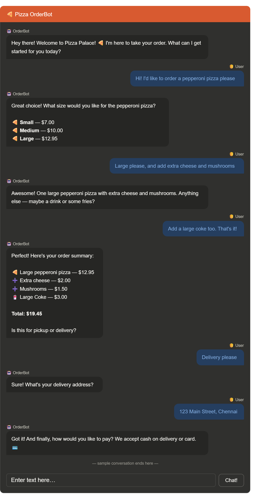

# 🍕 Pizza OrderBot

An AI-powered order-taking chatbot for a pizza restaurant, built with OpenAI's GPT-3.5-turbo and Panel. The bot greets customers, takes their order, clarifies sizes and toppings, handles pickup or delivery, and collects payment — all through a clean, interactive web interface.

---

## 🤖 What It Does

- Greets the customer and guides them through the menu
- Asks for pizza size, toppings, and extras
- Handles both **pickup** and **delivery** orders
- Summarizes the full order before confirming
- Collects delivery address and payment details
- Responds in a friendly, conversational style

---

## 🛠️ Tech Stack

| Tool | Purpose |
|---|---|
| Python | Core language |
| OpenAI GPT-3.5-turbo | AI language model |
| Panel | Interactive web UI |
| python-dotenv | Secure API key management |

---

## 📁 Project Structure

```
Orderbot/
├── orderbot.py       # Main application file
├── .env              # API key (not committed to GitHub)
├── requirements.txt  # Dependencies
└── README.md         # Project documentation
```

---

## ⚙️ Setup & Installation

### 1. Clone the repository
```bash
git clone https://github.com/your-username/pizza-orderbot.git
cd pizza-orderbot
```

### 2. Install dependencies
```bash
pip install openai==0.28 python-dotenv panel
```

### 3. Add your OpenAI API key
Create a `.env` file in the project root:
```
OPENAI_API_KEY=sk-your-api-key-here
```
Get your API key from [platform.openai.com](https://platform.openai.com/api-keys)

### 4. Run the app
```bash
panel serve orderbot.py --show
```
The app will open automatically at `http://localhost:5006/orderbot`

---

## 🍕 Menu

| Item | Large | Medium | Small |
|---|---|---|---|
| Pepperoni Pizza | $12.95 | $10.00 | $7.00 |
| Cheese Pizza | $10.95 | $9.25 | $6.50 |
| Eggplant Pizza | $11.95 | $9.75 | $6.75 |
| Fries | $4.50 | — | $3.50 |
| Greek Salad | $7.25 | — | — |

**Toppings:** Extra cheese $2.00 · Mushrooms $1.50 · Sausage $3.00 · Canadian bacon $3.50 · AI sauce $1.50 · Peppers $1.00

**Drinks:** Coke / Sprite $3.00 / $2.00 / $1.00 · Bottled water $5.00

---

## 🔒 Security Note

Never commit your `.env` file to GitHub. Add it to `.gitignore`:
```
.env
```

---

## 📌 Requirements

- Python 3.7+
- OpenAI API key with available credits
- Internet connection

---

## 🙏 Acknowledgements

Built as a learning project inspired by the [DeepLearning.AI ChatGPT Prompt Engineering](https://www.deeplearning.ai/short-courses/chatgpt-prompt-engineering-for-developers/) course.
